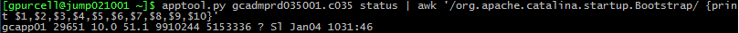
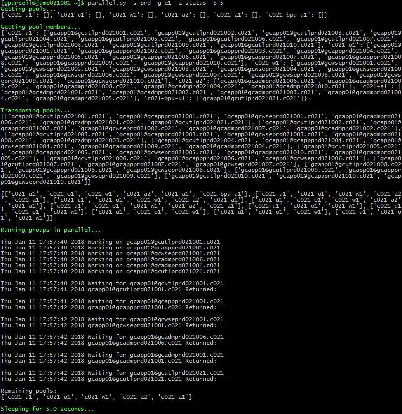
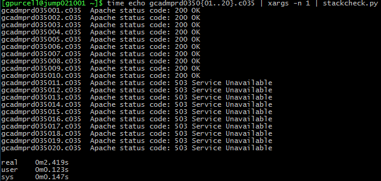

# Apache Tomcat Scripts

### apptool.py
###### Kill, start, bounce, and show status of Tomcat on app servers.

### parallel.py
###### With multiple databases, start/restart appservers in parallel, but only one appserver per database at a time.  Basically, the appservers pool lists are gathered from a cmdb, the lists are transposed, and the start/restart commands are run.

### stackcheck.py
###### Get the HTTP response status codes of the dr-status and db_xs pages.

