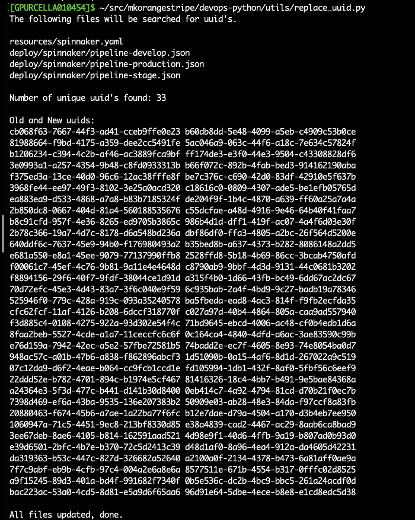
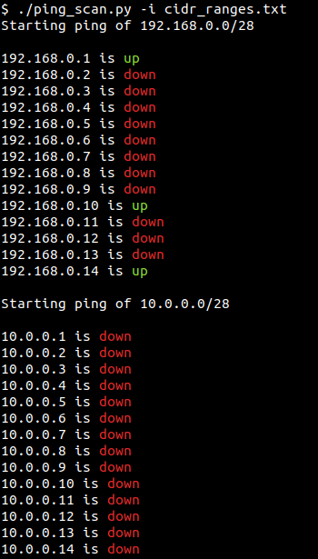

# Utility Scripts

### replace_uuid.py
###### This script replaces uuid's in the given files with new uuid's. Multiple occurrences of a unique uuid will be replaced with the same new uuid. Optionally the application name can also be replaced with a new name.

### pingscan.py
###### Scan a network by pinging a CIDR range in parallel.

