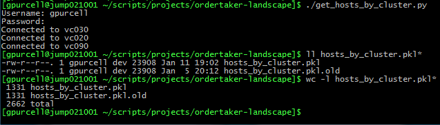
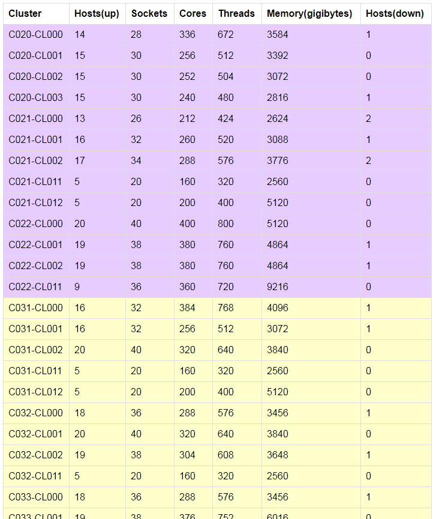
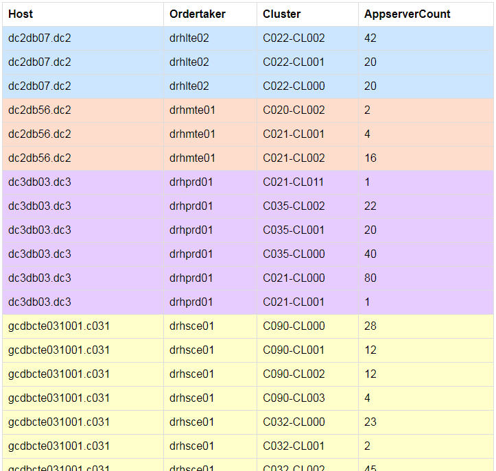

# vSphere Scripts

### get_hosts_by_cluster.py
###### Gather lists of ESXi hosts by vSphere cluster and output to file.

### cluster_info.py
###### Gather system resource info from VMware ESXi hosts and create totals by vSphere cluster.

### ot_landscape.py
###### Determine which ordertakers (databases) are using which vSphere clusters based on the numbers of appservers (VMs) residing on each cluster.

